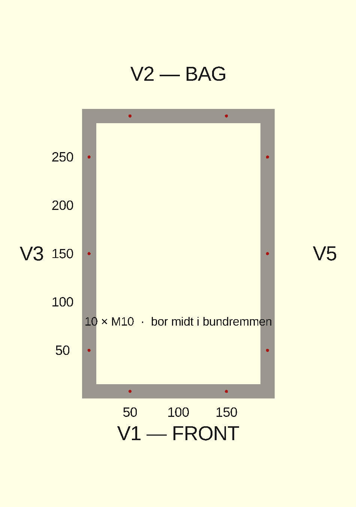

# Monter bundrem, murpap og ankerbolte

> Detalje til arbejdsplan → trin **3. Konstruktions-skelet**.
> Samler tre trin: DPC-murpap på ringen, bundrem ovenpå, og ankerbolte boret igennem ned i topskiftet.

Det er nemmest at bore bolthullerne FØRST når murpap og bundrem ligger på plads — så borer du
i ét hug gennem bundrem + murpap + ned i betonen, og hullet sidder præcis hvor bolten skal.
Du slipper for at måle huller op separat i murpap og bundrem, som alligevel ikke flugter med boltene.

## Rækkefølge

1. **Murpap (DPC)** rulles ud på hele sokkel-ringen — bryder opstigende fugt mellem beton og træ.
2. **Bundrem** (45×95 mm trykimpr.) lægges ovenpå, flugtende med ringens yderside. Tjek vater,
   90° hjørner og ens diagonaler, FØR du borer.
3. **Bor + sæt ankerbolte:** mærk de 10 positioner (se tegning), bor lodret gennem bundrem +
   murpap ~75 mm ned i topskiftet (typisk Ø8 for M10 betonskrue — følg ankerproducentens tabel),
   blæs hullet rent, og spænd **M10 × 120** så hoved + spændskive klemmer bundremmen mod ringen.

## Ankerbolte — antal & placering

- **10 stk M10 × 120 mm**, c/c 1000 mm. **Bor midt i bundremmen.**
- Korte vægge (V1 front, V2 bag): 2 stk — 50 cm fra hver ende.
- Lange vægge (V3 venstre, V4 højre): 3 stk — 50 cm fra hver ende + 1 i midten.
- Ryk en bolt et par cm, hvis den lander under en stolpe.

## Acceptkriterier

- [ ] Murpap dækker hele ringen — ingen træ direkte mod beton.
- [ ] Bundrem i vater, hjørner 90°, flugter med ringens yderside.
- [ ] 10 bolte sat (2+2 korte vægge, 3+3 lange), boret i ét hug gennem bundrem + murpap + beton.
- [ ] Hoved/spændskive klemmer bundremmen — intet spil mellem rem og ring.
