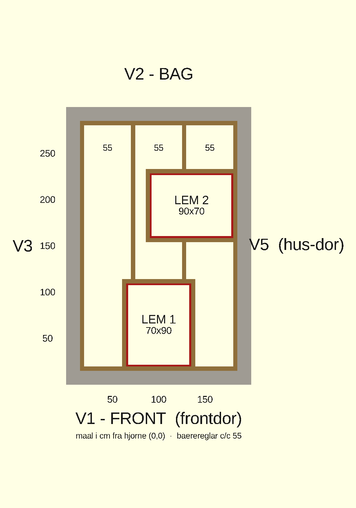

# Gulv — reglar, lemme og dæk

> Detalje til arbejdsplan → trin **2. Gulv**.
> **Ét lag** 45×95 reglar (bærereglar i Y c/c ≤600 + for/bag-reglar + karm) + ~25 mm dæk i X.
> **Alm. gran — IKKE trykimprægneret.**

## Plan

*Renderet direkte fra `src/designs/house/floor.scad` — tegning og kode er samme kilde.*

Grå = fundablok-ringen + kælder-pit'en. Brunt = **ét lag 45×95 reglar**:

- **4 bærereglar i Y** (2700 mm), c/c ≤600: V3 + V5 (kant, dem du har skåret) + **2 mellem-reglar**.
- **2 for/bag-reglar i X** (1610 mm): V1 + V2.
- **Fuld reglar-ramme om hver lem** (2 trimmer i Y + 2 veksler i X) — det er dem der holder lemmen.

**Gulvbrædderne løber i X** (1700 mm) oven på bærereglarne — derfor skal bærereglarne løbe i **Y**
(vinkelret) for at bære dem. De mellem-reglar/kanter der rammer en lem skæres til mod karmen.

## Opbygning (z = mm over terræn)

Gulvet er **ét lag reglar** — intet stablet. Kant-reglarne (V3/V5) skrues på ringen; mellem-reglarne
hænges i strøsko.

| Element | Dimension | Underkant z | Overkant z |
|---|---|---|---|
| **Reglar (ét lag)** | 45×95 på højkant | 0 | **95** |
| Gulvbrædder | ~25 mm savskåret | 95 | **120** (flugter sokkel-top) |
| *(kælder)* betonslab | 100 mm på stabilgrus | −780 | **−680** (ringbund) |

**Gulv-overkant = z120 = sokkel/fundament-top.** Bundremmens overkant ("sill") ligger 47 mm højere
(z167 = sokkel 120 + DPC 2 + bundrem 45), så bundremmen står som en kant rundt om gulvet.

## Skæreliste — reglar 45×95 (alm. gran)

| Stk | Længde | Til | Status |
|---|---|---|---|
| 2 | 2700 mm | Kant-bærereglar V3 + V5 (i Y) | ✅ allerede skåret |
| 2 | 2700 mm | Mellem-bærereglar (i Y), c/c ~550 | skæres |
| 2 | 1610 mm | For/bag-reglar V1 + V2 (i X) | skæres |
| 2 | 990 mm | LEM 1 — trimmer (i Y) | skæres |
| 2 | 700 mm | LEM 1 — veksler (i X) | skæres |
| 1 | 790 mm | LEM 2 — venstre trimmer (i Y; højre side = V5) | skæres |
| 2 | 900 mm | LEM 2 — veksler (i X) | skæres |

> Gulvbrædderne skæres til på stedet (1700 mm) — se materialelisten for mængde.

## Materialeliste — hvad du skal købe

Alt i **alm. gran (ikke trykimpr.)**.

| # | Vare | Beregning | Køb |
|---|---|---|---|
| 1 | Reglar 45×95 à **2,7 m** | 2 mellem-bærereglar (i Y) — **passer ikke i 2,4 m-bilen** (samme som dine kanter) | **2 stk** |
| 2 | Reglar 45×95 à **2,4 m** | V1/V2 (2× 1610) + alle lem-ramme-stykker (2× 990, 1× 790, 2× 900, 2× 700) — pakkes i 5 længder | **5 stk** |
| 3 | Reglar 45×95 à 2,7 m | Kant V3/V5 | 0 (har 2) |
| 4 | Gulvbrædder 25×150 savskåret à 2,4 m | Dæk ~3,3 m² netto; løber i **X (1700 mm)** → passer i bilen, **ingen samling** | **~14 stk** |
| 5 | Strøsko (bjælkesko) 45 mm | Mellem-reglars ender + cut-ender ved karm | ~10 stk |
| 6 | Betonskruer Ø7,5×100 (+ Ø6 bor) | Kant + for/bag-reglar → ring, c/c ~500 | ~20 stk |
| 7 | Skruer 4,5×60 forzinket | Dæk + karm | ~200 stk |
| 8 | Beslagskruer 5×40 | Til strøsko | ~1 pk |
| 9 | Lem-låg 25 mm (krydsfiner/brædder) | 2 låg à ~0,63 m² | 2 stk |
| 10 | Hængsler + greb | Pr. låg: 2 hængsler + 1 greb | 4 + 2 stk |

**Reglar i alt: 2 stk à 2,7 m + 5 stk à 2,4 m at købe (+ dine 2 stk à 2,7 m).**
De eneste >2,4 m er de 2 mellem-bærereglar (de SKAL løbe i Y = 2700, ligesom kanterne). Alt andet passer i bilen.

**Værktøj:** boremaskine + Ø6 betonbor, skruemaskine, vaterpas, hånd- + stiksav (lem-udskæring), tommestok.

## Rækkefølge

1. **Kant-bærereglar V3 + V5** (2700) skrues på ringens inderside med betonskruer (overkant z95, vater).
2. **For/bag-reglar V1 + V2** (1610) skrues på ringen i hver ende (X).
3. **2 mellem-bærereglar** (2700) hænges i strøsko, c/c ≤600 mellem V3 og V5.
4. **Reglar-ramme om hver lem** (2 trimmer i Y + 2 veksler i X) — bokser lemmen ind; de mellem-bærereglar der rammer en lem skæres til mod rammen. Falsen til låget i niveau med dækket.
5. **Gulvbrædder** ~25 mm løber i **X** (1700) oven på bærereglarne. Lad lem-åbninger stå.

## Lemme (2 stk · hver 70 × 90 cm åbning)

| Lem | Åbning (i ringen) | Mål | Ved | Trappe ned |
|---|---|---|---|---|
| **LEM 1** | X 65..135 cm · Y 19,5..109,5 cm | 70 × 90 cm (lang i Y) | under frontdøren (V1) | mod bagvæg (+Y) |
| **LEM 2** | X 90,5..180,5 cm · Y 158,5..228,5 cm | 90 × 70 cm (lang i X) | ved hus-døren (V5) | mod V3 (−X) |

## Trapper (bygges nede i kælderen)

To stejle adgangstrapper (~53°), én under hver lem, ned til betonslabben (fald ~800 mm):
bredde **550 mm**, **6 trin** (stødtrin ~133 mm, grund 100 mm). Hver lem får et hængslet låg.
Selve trappe-/kælderarbejdet hører til kælder-opgaven.

## Acceptkriterier

- [ ] Ét lag 45×95 reglar: 4 bærereglar i Y c/c ≤600 + V1/V2 + reglar-ramme om hver lem — intet stablet.
- [ ] Gulvbrædder løber i X, båret c/c ≤600.
- [ ] Begge lemme bokset ind med reglar-ramme; LEM 1 lang i Y, LEM 2 lang i X (følger trappen).
- [ ] Dæk-overkant z120, flugter sokkel-top; de to lem-åbninger står frie og passer til lågene.
