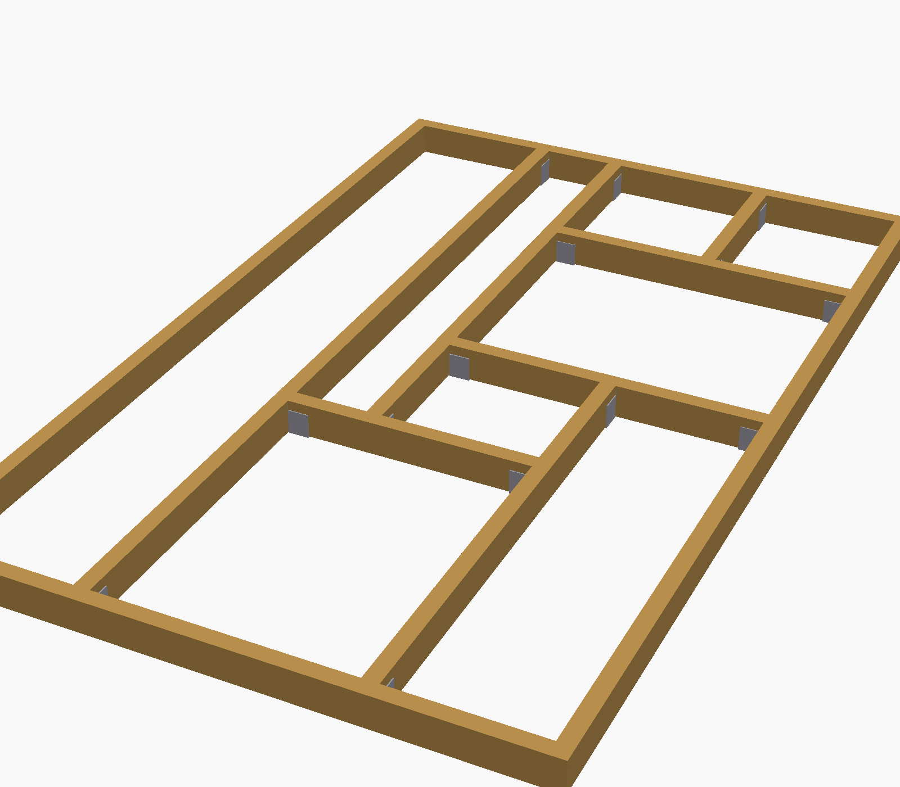
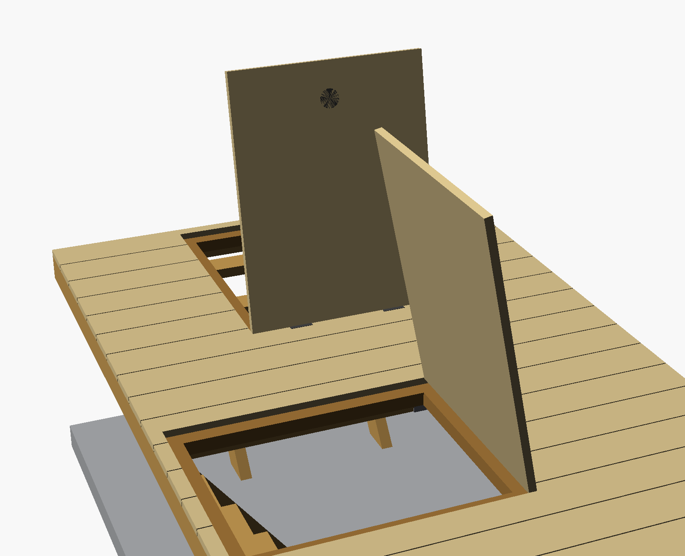

# Gulv — reglar, lemme og dæk

> Detalje til arbejdsplan → trin **2. Gulv**.
> **Ét lag** 45×95 reglar (bærereglar i Y c/c ≤600 + for/bag-reglar + veksler om lemmene) + ~25 mm dæk i X.
> **Alm. gran — IKKE trykimprægneret.**

## Plan


*Renderet direkte fra `src/designs/house/floor.scad` — tegning og kode er samme kilde.*

Grå = fundablok-ringen + kælder-pit'en. Brunt = **ét lag 45×95 reglar**:

- **5 bærereglar i Y** (2700 mm), c/c ≤600: V3 + V5 (kant, dem du har skåret) + **3 mellem-reglar**.
  De 3 mellem-reglar er lagt på lem-kanterne, så de **også udgør lemmenes sider** — ingen separate trimmer.
- **2 for/bag-reglar i X** (1610 mm): V1 + V2.
- **Hver lem bokses af veksler i X** + de 2 bærereglar der løber forbi som sider.
  LEM 2: 2 veksler. LEM 1: kun **1 veksel** (bagenden) — forenden flugter V1, så V1 er forkanten.

**Gulvbrædderne løber i X** (1700 mm) oven på bærereglarne — derfor skal bærereglarne løbe i **Y**
(vinkelret) for at bære dem. Bærereglar der krydser en lem-åbning skæres ud i åbningen; lem-sidens
reglar løber helt forbi.

## Opbygning (z = mm over terræn)

Gulv-rammens **omrids er 1700 (X) × 2700 (Y) mm** = ringens indvendige mål; overkant **z95**. Reglarne
overlapper **ikke**: de **2700-lange løber i Y** (V3/V5 langs siderne + 3 inde i), mens **V1/V2 i X kun
er 1610** (= 1700 − 2×45) og passer ind *mellem* dem (butter op, intet overlap). De **1700-lange er
gulvbrædderne**, som ligger i laget ovenpå (z95..120) og derfor godt må spænde hele bredden. Gulvet er
**ét lag reglar** — intet stablet; kant-reglarne (V3/V5) skrues på ringen, mellem-reglarne hænges i strøsko.

> **Fugt:** reglar og dæk er **ubehandlet gran** over kælder-pit'en — kælderen skal ventileres
> (kælder-opgaven), ellers rådner gulvet.

| Element | Dimension | Underkant z | Overkant z |
|---|---|---|---|
| **Reglar (ét lag)** | 45×95 på højkant | 0 | **95** |
| Gulvbrædder | ~25 mm savskåret | 95 | **120** (flugter sokkel-top) |
| *(kælder)* betonslab | 100 mm på stabilgrus | −780 | **−680** (ringbund) |

**Gulv-overkant = z120 = sokkel/fundament-top.** Bundremmens overkant ("sill") ligger 47 mm højere
(z167 = sokkel 120 + DPC 2 + bundrem 45), så bundremmen står som en kant rundt om gulvet.

**Beslag:** de 3 mellem-bærereglar og de 3 veksler hænges i **strøsko** (45×95 bjælkesko) dér hvor de
rammer en tværregel — i alt **14 strøsko**. V3/V5 og V1/V2 hviler på ringen og får ingen.



*Reglar-rammen uden dæk (fra `img/_beslag_view.scad`). Grå = strøsko ved hvert hængt knudepunkt.*

## Skæreliste — reglar 45×95 (alm. gran)

| Stk | Længde | Til | Status |
|---|---|---|---|
| 2 | 2700 mm | Kant-bærereglar V3 + V5 (i Y) | ✅ allerede skåret |
| 3 | 2700 mm | Mellem-bærereglar (i Y) — dobbelt som lem-sider | skæres |
| 2 | 1610 mm | For/bag-reglar V1 + V2 (i X) | skæres |
| 1 | 700 mm | LEM 1 — veksel (bagende; forende = V1) | skæres |
| 2 | 900 mm | LEM 2 — veksler (i X) | skæres |

> Gulvbrædderne skæres til på stedet (1700 mm) — se materialelisten for mængde.

## Materialeliste — hvad du skal købe

Alt i **alm. gran (ikke trykimpr.)**.

| # | Vare | Beregning | Køb |
|---|---|---|---|
| 1 | Reglar 45×95 à **2,7 m** | 3 mellem-bærereglar (i Y) — **passer ikke i 2,4 m-bilen** (samme som dine kanter) | **3 stk** |
| 2 | Reglar 45×95 à **2,4 m** | V1/V2 (2× 1610) + veksler (2× 900, 1× 700) — pakkes i 3 længder | **3 stk** |
| 3 | Reglar 45×95 à 2,7 m | Kant V3/V5 | 0 (har 2) |
| 4 | Gulvbrædder 25×150 savskåret à 2,4 m | **18 bræt-rækker** à 1700 mm (dybde 2700 / 150 mm); løber i **X** → passer i bilen, **ingen samling**. 700 mm-afskær kan genbruges til lem-rækkerne | **18 stk** (~13 hvis afskær genbruges) |
| 5 | Strøsko (bjælkesko) 45 mm | 8 bærereglar-ender + 6 veksel-ender (se beslag-billede) | 14 stk |
| 6 | Betonskruer Ø7,5×100 (+ Ø6 bor) | Kant + for/bag-reglar → ring, c/c ~500 | ~20 stk |
| 7 | Skruer 4,5×60 forzinket | Dæk + veksler/fals | ~200 stk |
| 8 | Beslagskruer 5×40 | Til strøsko | ~1 pk |
| 9 | Lem-låg 25 mm krydsfiner (vejrbestandig) | tilskåret ~5 mm mindre end åbningen | 2 stk |
| 10 | Anslagsliste 45×45 (fals, ovk z95 indvendigt) | omkreds ~3,2 lbm pr. lem | ~7 lbm |
| 11 | Revle 45×45 u. låget (afstivning) | 1–2 pr. låg, i alm. gran | ~3 lbm |
| 12 | Hængsler (mortiseret) | 2 pr. låg | 4 stk |
| 13 | Planforsænket klapgreb | 1 pr. låg | 2 stk |
| 14 | Hold-åben strut/krog | 1 pr. låg | 2 stk |

**Reglar i alt: 3 stk à 2,7 m + 3 stk à 2,4 m at købe (+ dine 2 stk à 2,7 m).**
De eneste >2,4 m er de 3 mellem-bærereglar (de SKAL løbe i Y = 2700, ligesom kanterne). Alt andet passer i bilen.

**Værktøj:** boremaskine + Ø6 betonbor, skruemaskine, vaterpas + **lang retskede** (tjek reglar-plan),
hånd- + stiksav (lem-udskæring), **stemmejern + evt. overfræser** (hængsel-mortise + greb-fals),
vinkel, tommestok.

## Rækkefølge

1. **Kant-bærereglar V3 + V5** (2700) skrues på ringens inderside med betonskruer (overkant z95, vater).
2. **For/bag-reglar V1 + V2** (1610) skrues på ringen i hver ende (X).
3. **3 mellem-bærereglar** (2700) hænges i strøsko: to på LEM 1's sider (c/c-center 627,5 + 1372,5) og én på LEM 2's venstre side (882,5). Maks. spænd ~49 cm. **Tjek med en lang retskede at alle 5 reglar-overkanter ligger i ét plan (z95)** før du fortsætter.
4. **Veksler** (i X) sættes mellem side-reglarne, så hver lem er bokset ind: LEM 2 får 2 veksler, LEM 1 kun 1 (forenden er V1). Bærereglar der krydser en åbning skæres ud i selve åbningen. Søm **anslagsliste (fals) 45×45 på indersiden, ovk z95** — den hylde låget hviler på (se *Sådan bygger du en lem*).
5. **Gulvbrædder** ~25 mm løber i **X** (1700) oven på bærereglarne. Lad lem-åbninger stå.
6. **Byg + monter lemmene** — låg (25 mm + revler), greb og hængsler (se *Sådan bygger du en lem*). Gøres typisk efter trapperne er på plads.

## Lemme (2 stk · hver 70 × 90 cm åbning)

| Lem | Åbning (i ringen) | Mål | Ved | Trappe ned |
|---|---|---|---|---|
| **LEM 1** | X 65..135 cm · Y 19,5..109,5 cm | 70 × 90 cm (lang i Y) | under frontdøren (V1) | mod bagvæg (+Y) |
| **LEM 2** | X 90,5..180,5 cm · Y 158,5..228,5 cm | 90 × 70 cm (lang i X) | ved hus-døren (V5) | mod V3 (−X) |

## Sådan bygger du en lem (fals + låg)

Lemmen er en **udtagelig/hængslet del af gulvet** — samme **25 mm** tykkelse som dækket, så den
flugter. To ting skal være på plads: en **fals (anslag)** den hviler på, og et **planforsænket greb**
så den kan løftes uden at man snubler.



*Renderet fra `img/_lem_view.scad` (gulv + kælder fra modellen). Begge låg er vist åbne: den orange
inderkant i åbningen er **falsen** (anslagslisten), og den nedsænkede ring på låg-oversiden er **grebet**.*

### 1. Falsen — så låget ikke falder ned i kælderen

Søm en **anslagsliste 45×45 hele vejen rundt på indersiden** af lem-rammen (de reglar der bokser
åbningen), med **overkant i z95** — altså lige under dækket. Listen rager ~45 mm ind i åbningen og
danner en hylde. Låget (25 mm) lægges ned i den **25 mm dybe fals** og hviler på listen, så
**overkant flugter dækket (z120)**. Det kan ikke falde igennem, fordi det er større end det frie hul.

```
   (gulv-side)                              (åbning / kælder)
   dæk 25 ───────┐    ~4 mm luft   ┌─────── låg 25 ───────────
   z120 .........│................│.......................   ← overkant, flugter dæk
   z95  ─────────┤▓▓▓▓▓▓▓▓▓▓▓▓▓▓▓▓│   låget hviler på listen
   ramme-regel   │  anslagsliste  │
   45×95         │  45×45 (fals)  │
   z0   ─────────┘                └───────  ▼  frit hul ned til trappen
```

### 2. Lågets mål (≈4–5 mm luft hele vejen rundt)

| Lem | Åbning | Frit hul (efter fals) | **Låg** |
|---|---|---|---|
| LEM 1 | 700 × 900 | ~610 × 810 | **~695 × 895** |
| LEM 2 | 900 × 700 | ~810 × 610 | **~895 × 695** |

### 3. Selve låget

**25 mm vejrbestandig krydsfiner** (eller pløjede brædder fastgjort til en plade). Skru **1–2 revler
(45×45) på undersiden**, placeret *inden for* det frie hul — de afstiver låget mod en voksen-fod og
holder det fra at slå sig. Lader du revlerne stikke lidt ned i hullet, **låser de samtidig låget mod
at skride sidelæns**.

### 4. Løft + hængsling

- **Planforsænket klapgreb** fræset ned i oversiden (flugter — ingen snublekant). Vip ringen op og træk.
- **2 hængsler** på den angivne kant (LEM 1: bagkant **+Y** · LEM 2: mod **V3, −X**), **mortiseret** så
  de flugter. Vil du helt undgå beslag i gulvet, kan låget i stedet være **løst (lift-out)** og bare
  løftes væk på grebet — enklere, men kan lægges forkert.
- **Hold-åben:** en simpel strut/krog der låser låget åbent mens du er på trappen, så det ikke kan
  klappe ned over dig.

## Trapper (bygges nede i kælderen)

To stejle adgangstrapper (~53°), én under hver lem, ned til betonslabben (fald ~800 mm):
bredde **550 mm**, **6 trin** (stødtrin ~133 mm, grund 100 mm). Hver lem får et hængslet låg.
Selve trappe-/kælderarbejdet hører til kælder-opgaven.

## Acceptkriterier

- [ ] Ét lag 45×95 reglar: 5 bærereglar i Y c/c ≤600 (3 mellem-reglar ligger på lem-kanterne) + V1/V2 + veksler (LEM 2: 2 · LEM 1: 1, forende = V1) — intet stablet.
- [ ] Gulvbrædder løber i X, båret c/c ≤600.
- [ ] Begge lemme bokset ind; sider = bærereglar, ender = veksler. LEM 1 lang i Y, LEM 2 lang i X (følger trappen).
- [ ] Dæk-overkant z120, flugter sokkel-top; de to lem-åbninger står frie og passer til lågene.
- [ ] Hver lem har anslagsliste (fals) med ovk z95; låget flugter dækket og kan ikke falde ned i kælderen.
- [ ] Planforsænket greb (ingen snublekant) + hold-åben-sikring på hvert låg.
