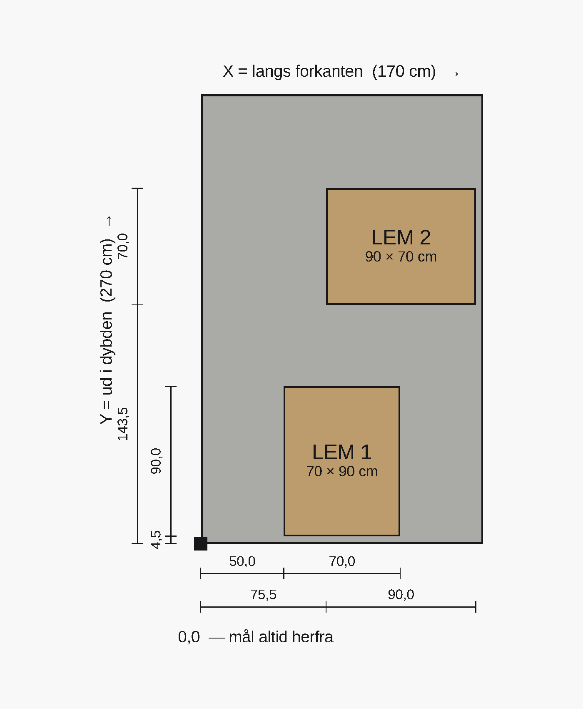

# Gulv — kort & opmåling

## Gulvkonstruktion

Består af et lag **45×95 reglar** som er sænket 25mm fra overkanten af sokkel-toppen.
Oven på reglarne ligger et dæk af **gulvbrædder 25×150**, som er skruet fast i reglarne. Dæk-overkant flugter sokkel-top.

## Mål altid fra ét hjørne

Hæng tommestokken i dækkets **forreste venstre indvendige hjørne (0,0)**:
- **X** = langs forkanten, 0 → 170 cm (venstre → højre).
- **Y** = ud i dybden, 0 → 270 cm (forkant → bagvæg).

*På billedet: øverste målrække/-søjle (50,0 + 70,0 / 4,5 + 90,0) hører til LEM 1,
den anden (75,5 + 90,0 / 143,5 + 70,0) til LEM 2.*

## Hvor lemmene sidder

| Lem | Start fra venstre (X) | Start fra forkant (Y) | Størrelse | Slutter ved |
|---|---|---|---|---|
| **LEM 1** | **50,0 cm** | **4,5 cm** | 70 cm (X) × 90 cm (Y) | X 120,0 · Y 94,5 cm |
| **LEM 2** | **75,5 cm** | **143,5 cm** | 90 cm (X) × 70 cm (Y) | X 165,5 · Y 213,5 cm |

Altså: **LEM 2's nærmeste hjørne ligger 75,5 cm inde fra venstre og 143,5 cm inde
fra forkanten** — derfra 90 cm mod højre og 70 cm bagud.
