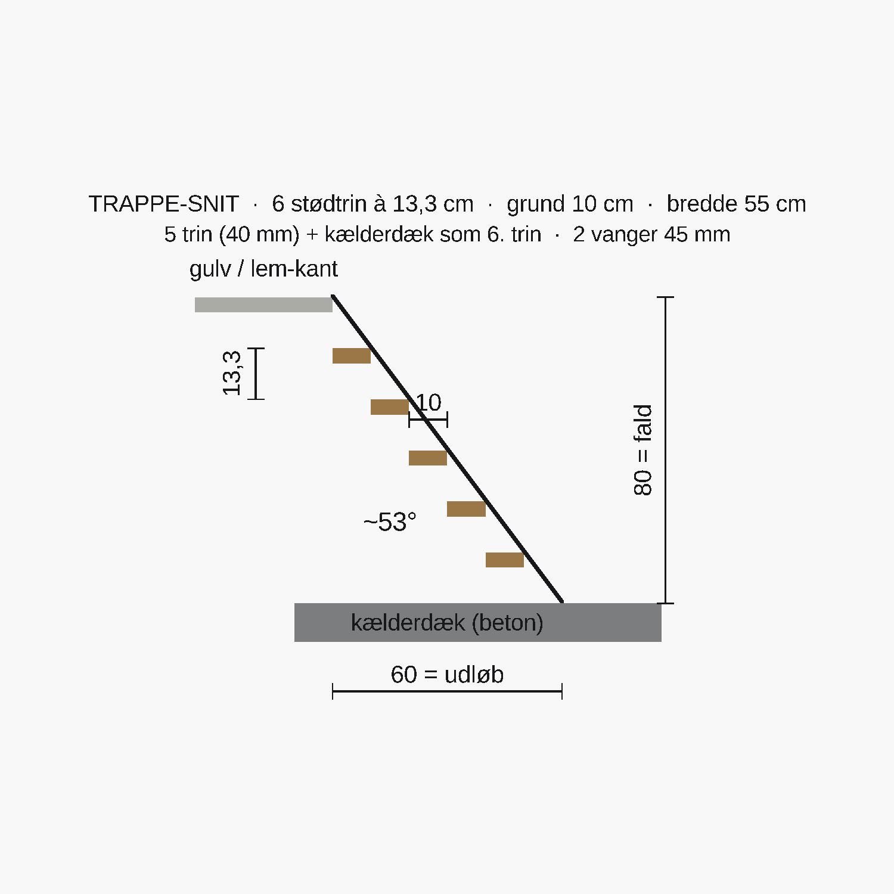

# Lem & trappe — sådan bygger du dem

> De to sværeste ting i gulvet. **Hvor** lemmene sidder står i
> **[gulv-stroer-lem.md](gulv-stroer-lem.md)** — her er **hvordan** du bygger dem.
> Alt i alm. gran / vejrbestandig krydsfiner — **ikke trykimprægneret**.
> Byg typisk **trapperne først**, lemmene til sidst.

## Indkøb (kun til lem + trappe)

| Vare | Mål | Antal | Til |
|---|---|---|---|
| Krydsfiner vejrbestandig | 25 mm | 2 plader-emner | Lågene (skåret ~0,5 cm mindre end åbningen) |
| Anslagsliste | 45×45 mm | ~7 lbm | Falsen — hylde låget hviler på |
| Revle | 45×45 mm | ~3 lbm | 2 stk under hvert låg (afstivning) |
| Hængsel, mortiseret | — | 4 stk (2 pr. låg) | Hængselkant |
| Planforsænket klapgreb | — | 2 stk | Løft uden snublekant |
| Hold-åben strut/krog | — | 2 stk | Låser låget åbent på trappen |
| Trin (plank) | 40 mm, 55 cm lange | 10 stk (5 pr. trappe) | Trappetrin |
| Vange (regel) | 45×145–160, ~1,1 m | 4 stk (2 pr. trappe) | Trappevanger |
| Skruer rustfri/forzinket | 5×60 + beslagskruer | 1 pk | Trin, vanger, fals, hængsler |

---

# DEL A — Lemmen (× 2)

Lemmen er et **udtageligt/hængslet stykke gulv** i samme 25 mm tykkelse som dækket,
så den flugter. To ting afgør det: en **fals** den hviler på, og et **greb** den
løftes i.


*Begge låg vist åbne. Orange inderkant i åbningen = **falsen**. Ringen på
låg-oversiden = **grebet**.*

## A1 · Marker og skær åbningen

Mål fra dækkets forreste venstre hjørne (se gulv-guiden):

| Lem | Fra venstre (X) | Fra forkant (Y) | Størrelse |
|---|---|---|---|
| LEM 1 | **50,0 cm** | **4,5 cm** | 70 × 90 cm |
| LEM 2 | **75,5 cm** | **143,5 cm** | 90 × 70 cm |

1. Afsæt de 4 hjørner, slå rette vinkler med **3-4-5** (30-40-50 cm).
2. Skær med stiksav langs stregen.
3. **Tjek støtten:** hver kant skal hvile på en regel/veksel at skrue dæk + fals i.
   Mangler der støtte langs en kant (fordi bærereglarne ikke ligger som planlagt),
   så skru en **ekstra veksel 45×95** ind langs kanten først.

## A2 · Falsen — så låget ikke kan falde ned

Søm/skru **anslagsliste 45×45 hele vejen rundt på indersiden** af åbningen, med
**overkant 2,5 cm under dæk-overkant** (= i niveau med dæk-undersiden). Listen
rager ~5 cm ind og danner en hylde. Låget (25 mm) lægges ned i den 2,5 cm dybe
fals og **flugter dækket** — det er større end det frie hul og kan ikke falde
igennem.

```
   (gulv-side)                          (åbning / kælder)
   dæk 25 ───────┐   ~0,5 cm luft  ┌─────── låg 25 mm ─────────
   z12 .........│...............│.....................  ← overkant flugter dæk
   z9,5 ────────┤▓▓▓▓▓▓▓▓▓▓▓▓▓▓│  låget hviler på falsen
   ramme-regel  │ anslagsliste │
   45×95        │ 45×45 (fals) │
   z0  ─────────┘              └──────  ▼  frit hul ned til trappen
```

## A3 · Lågets mål (~0,5 cm luft hele vejen)

| Lem | Åbning | **Låg** |
|---|---|---|
| LEM 1 | 70 × 90 cm | **~69,5 × 89,5 cm** |
| LEM 2 | 90 × 70 cm | **~89,5 × 69,5 cm** |

25 mm vejrbestandig krydsfiner. Skru **2 revler 45×45 på undersiden**, placeret
*inden for* det frie hul — de afstiver mod en voksen-fod og **låser samtidig låget
mod at skride sidelæns** når de stikker ned i hullet.

## A4 · Hængsel + greb

- **2 mortiserede hængsler** så de flugter, på den angivne kant:
  **LEM 1 = bagkant (mod +Y / bagvæg)** · **LEM 2 = venstre kant (mod V3, −X)**.
- **Planforsænket klapgreb** fræset ned i oversiden i den fri kant — ingen snublekant.
- **Hold-åben strut/krog** så låget ikke kan klappe ned over dig på trappen.
- (Alternativ: helt løst lift-out-låg uden hængsler — enklere, men kan lægges forkert.)

---

# DEL B — Trappen (× 2)

To stejle, lige trapper ned til betonslabben — én under hver lem. Begge har
**samme mål**.



## Mål (begge trapper ens)

| Størrelse | Værdi |
|---|---|
| Samlet fald (dæk → slab) | **80 cm** |
| Stødtrin (riser) | **13,3 cm** × 6 |
| Grund (going) | **10 cm** |
| Trinbredde | **55 cm** |
| Vandret udløb | **60 cm** |
| Hældning | **~53°** (stejl — som en skibstrappe) |
| Trin | 5 trin à 40 mm + **kælderdækket som 6. trin** |

## B1 · Vanger

To **vanger 45×~150**, én i hver side (55 cm fra inderkant til inderkant). Topkant
tuckes ind under dækket (z9,5), bund står på betonslabben (z−68). Skær trin-profilen
ud i vangen, **eller** skru trekantklodser på som trinholdere. Hældning ~53°,
vangelængde ~1,0–1,1 m.

## B2 · Trin

**5 trin à 40 mm, 55 cm brede**, skrues på vangerne med 13,3 cm mellem trin-overkanter
og 10 cm grund. Det 6. "trin" er selve **kælderdækket**.

## B3 · Hvor hver trappe lander (mål fra samme hjørne)

| Trappe | Under | Top (øverste trin) | Går ned mod | Bund lander | Centreret |
|---|---|---|---|---|---|
| **Front-trappe** | LEM 1 | 4,5 cm fra forkant | bagvæg (+Y) | **64,5 cm fra forkant** | i bredden: trin 57,5–112,5 cm fra venstre |
| **Menneske-trappe** | LEM 2 | 165,5 cm fra venstre | mod V3 (−X) | **105,5 cm fra venstre** | i dybden: trin 151–206 cm fra forkant |

Dvs. begge trapper starter i den **lem-kant der vender væk fra rummet** og løber
60 cm ind under gulvet, mens de falder de 80 cm ned til slabben.

---

## Acceptkriterier

- [ ] Begge åbninger skåret på mål, med støtte langs alle 4 kanter.
- [ ] Fals 45×45 hele vejen rundt, overkant 2,5 cm under dæk → låget flugter dækket og kan **ikke** falde ned.
- [ ] Låg ~0,5 cm mindre end åbningen, 2 revler under, planforsænket greb (ingen snublekant).
- [ ] Hængsler mortiseret på rigtig kant (LEM 1 bagkant · LEM 2 mod V3) + hold-åben-sikring.
- [ ] Begge trapper: 55 cm brede, 6 stødtrin à 13,3 cm, lander på slabben, vanger fast i top og bund.
