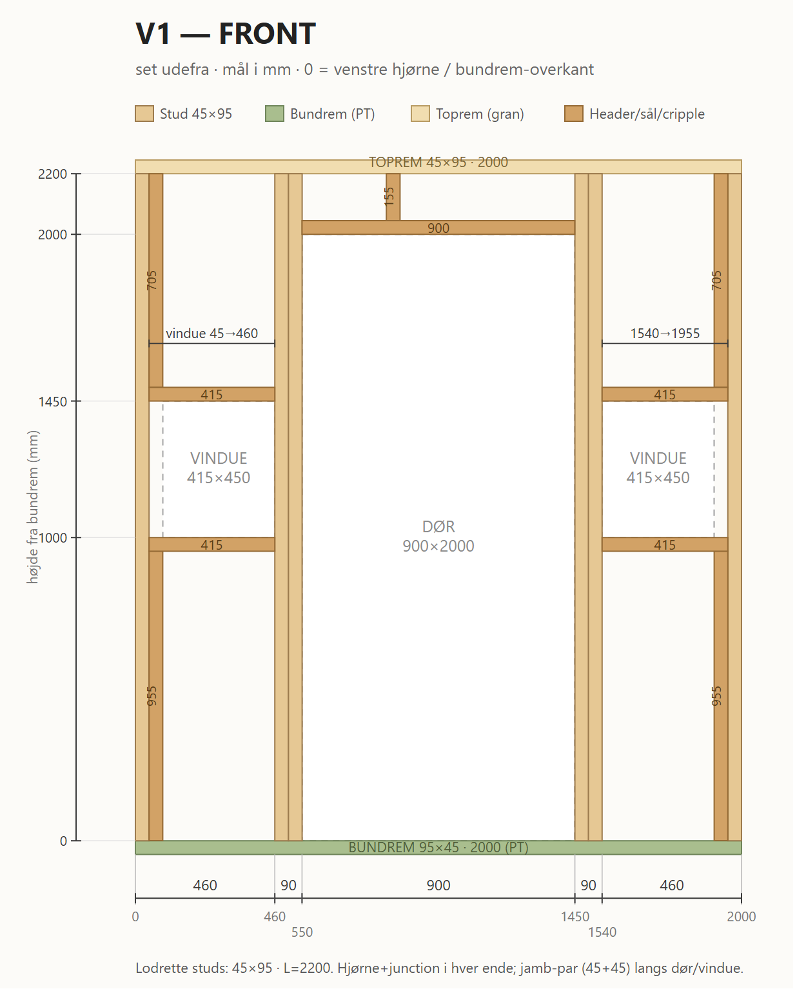

# V1 — Front

Front-væg, X=0..2000, Y=0. Åbninger: dør 900×2000 + 2 vinduer 415×450.

*Print/zoom: [V1-front.svg](V1-front.svg). Mål i mm, fra venstre hjørne (X) og bundrem-overkant (h).*

## Skæreliste

| Stk | Dim (mm) | Længde | Stykke |
| --- | -------- | ------ | ------ |
| 1 | 95×45 PT | 2000 | Bundrem |
| 1 | 95×45 gran | 2000 | Toprem |
| 6 | 45×95 C24 | 2200 | Studs (hjørne + junction + 2× dør-jamb + 2× vindue-jamb) |
| 2 | 45×95 C24 | 955 | Cripple under vindue-sål |
| 2 | 45×95 C24 | 705 | Cripple over vindue-header |
| 1 | 45×95 C24 | 155 | Cripple over dør-header |
| 1 | 95×45 C24 | 900 | Dør-header |
| 2 | 95×45 C24 | 415 | Vindue-header |
| 2 | 95×45 C24 | 415 | Vindue-sål |

**Åbninger (rough):** dør X=550, h=0..2000 · vinduer sål-top h=1000, header-bund h=1450 — venstre X=45..460, højre X=1540..1955.
