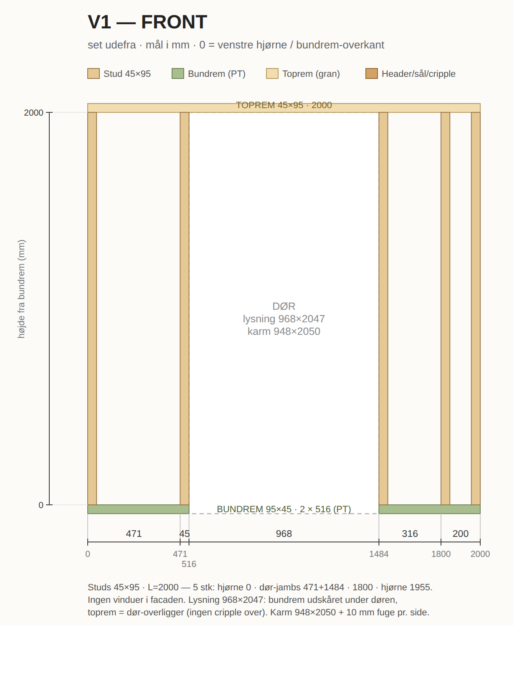

# V1 — Front

Front-væg, X=0..2000, Y=0. Eneste åbning: hoveddøren (karm 948×2050,
lysning 968×2047). **Ingen vinduer i facaden** — eneste glas i gavlen er
rombe-ruden i selve dørbladet.

*Print/zoom: [V1-front.svg](V1-front.svg). Mål i mm, fra venstre hjørne (X) og bundrem-overkant (h).*

## Skæreliste

| Stk | Dim (mm) | Længde | Stykke |
| --- | -------- | ------ | ------ |
| 2 | 95×45 PT | 516 | Bundrem — udskåret under døren (X=0..516 og X=1484..2000) |
| 1 | 95×45 gran | 2000 | Toprem (fungerer også som dør-header — lysning 2047 = fri væghøjde) |
| 5 | 45×95 C24 | 2000 | Studs — hjørne 0 · dør-jambs 471 + 1484 · 1800 · hjørne 1955 |

Ingen header, sål eller cripples på V1: døren går fra sokkeltop til
toprem-underkant, så topremmen er overligger.

**Åbning (rough):** dør X=516..1484 (968 bred), fra sokkel-overkant
(h = −47, dvs. 47 mm under bundrem-overkant) op til toprem-underkant
(h = 2000) → 2047 mm fri lysningshøjde.

**Dørkarm:** udvendigt 948 × 2050, monteret med 10 mm fuge i hver side.
Karmen er 3 mm højere end lysningen — høvl toprem-undersiden af ved
montage, eller opmål den byggede væg.
