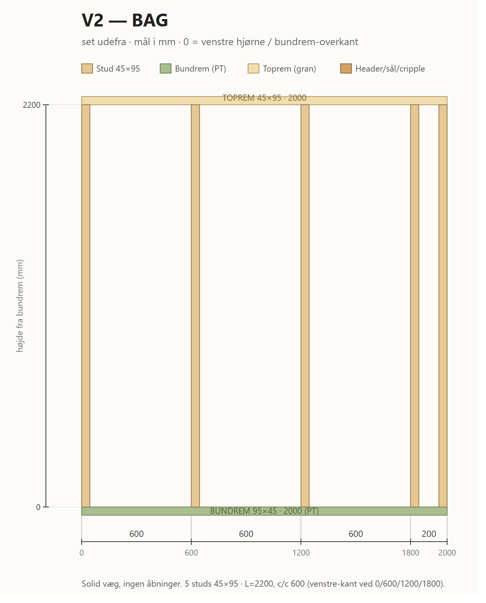

# V2 — Bag

Bag-væg, X=0..2000, Y=3000. Solid, ingen åbninger.

*Print/zoom: [V2-bag.svg](V2-bag.svg). Mål i mm, fra venstre hjørne (X) og bundrem-overkant (h).*

## Skæreliste

| Stk | Dim (mm) | Længde | Stykke |
| --- | -------- | ------ | ------ |
| 1 | 95×45 PT | 2000 | Bundrem |
| 1 | 95×45 gran | 2000 | Toprem |
| 5 | 45×95 C24 | 2200 | Studs — venstre-kant ved 0 / 600 / 1200 / 1800 + junction 1955 |
