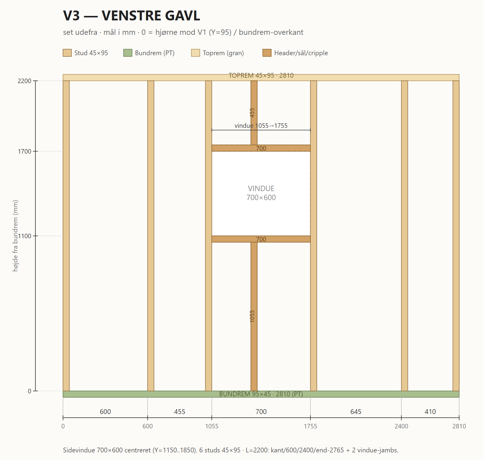

# V3 — Venstre gavl

Venstre gavl, X=0, Y=95..2905 (2810 lang). Åbning: sidevindue 700×600, centreret (Y=1150..1850), sål-top h=1100.

*Print/zoom: [V3-venstre.svg](V3-venstre.svg). Mål i mm, fra hjørne mod V1 (Y=95 = 0) og bundrem-overkant (h).*

## Skæreliste

| Stk | Dim (mm) | Længde | Stykke |
| --- | -------- | ------ | ------ |
| 1 | 95×45 PT | 2810 | Bundrem |
| 1 | 95×45 gran | 2810 | Toprem |
| 6 | 45×95 C24 | 2200 | Studs — kant ved 0 / 600 / 2400 + end-emit 2765 + 2× vindue-jamb (kant ved 1010 / 1755) |
| 1 | 45×95 C24 | 1055 | Cripple under vindue-sål |
| 1 | 45×95 C24 | 455 | Cripple over vindue-header |
| 1 | 95×45 C24 | 700 | Vindue-header |
| 1 | 95×45 C24 | 700 | Vindue-sål |

**Åbning (rough):** sidevindue Y=1150..1850 (p=1055..1755), sål-top h=1100, header-bund h=1700.
