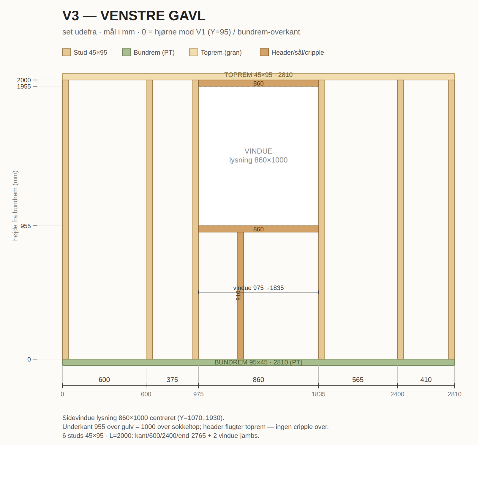

# V3 — Venstre gavl

Venstre gavl, X=0, Y=95..2905 (2810 lang) — husets frie langside
(løbegården ligger mod V4). Åbning: sidevindue, lysning 860×1000,
centreret (Y=1070..1930), sål-top h=955.

*Print/zoom: [V3-venstre.svg](V3-venstre.svg). Mål i mm, fra hjørne mod V1 (Y=95 = 0) og bundrem-overkant (h).*

## Skæreliste

| Stk | Dim (mm) | Længde | Stykke |
| --- | -------- | ------ | ------ |
| 1 | 95×45 PT | 2810 | Bundrem |
| 1 | 95×45 gran | 2810 | Toprem |
| 6 | 45×95 C24 | 2000 | Studs — kant ved 0 / 600 / 2400 + end-emit 2765 + 2× vindue-jamb (kant ved 930 / 1835) |
| 1 | 45×95 C24 | 910 | Cripple under vindue-sål |
| 1 | 95×45 C24 | 860 | Vindue-header |
| 1 | 95×45 C24 | 860 | Vindue-sål |

Ingen cripple **over** vinduet: headerens overside (h=2000) flugter
toprem-underkanten.

**Åbning (rough):** sidevindue Y=1070..1930 (p=975..1835), sål-top h=955,
header-bund h=1955. Sålen ligger 1000 mm over sokkeltop.

> **NB — mål skaleret af byggefoto, ikke opmålt.** Lysningen er aflæst på
> klink-skifterne (100 mm pr. skifte) på det byggede hus. Ret målene her og
> i `RH_SIDE_WIN_*` i `src/designs/config.scad` når vinduets karmmål og
> præcise placering er opmålt.
