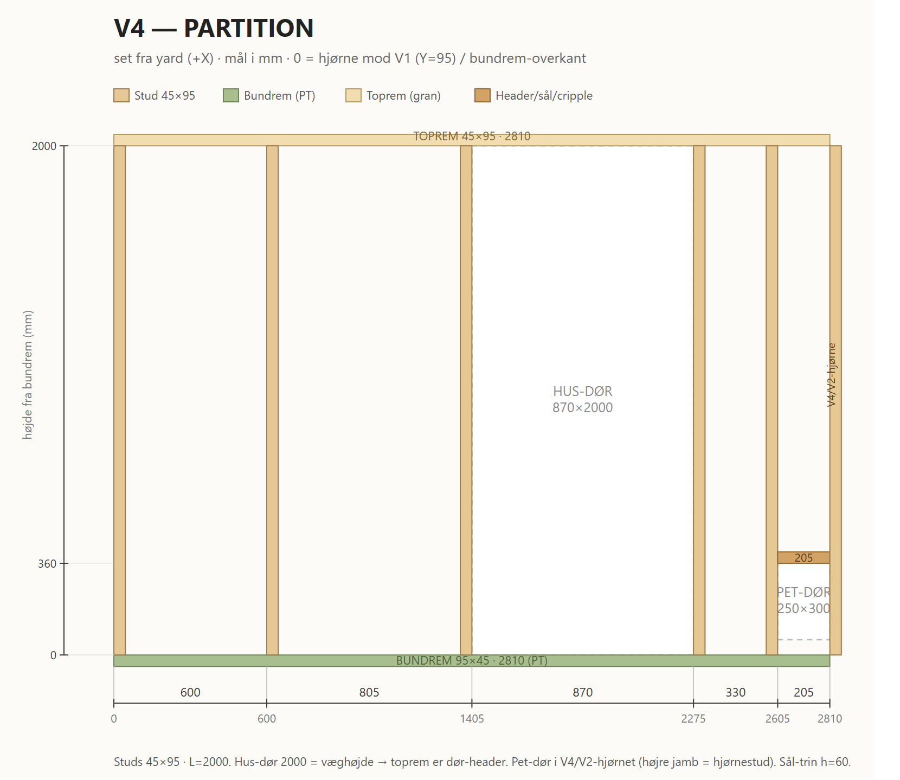

# V4 — Partition

Partition (mod yard), X=2000, Y=95..2905 (2810 lang). Åbninger: hus-dør 870×2000 + pet-dør 250×300.

*Print/zoom: [V4-partition.svg](V4-partition.svg). Mål i mm, fra hjørne mod V1 (Y=95 = 0) og bundrem-overkant (h).*

## Skæreliste

| Stk | Dim (mm) | Længde | Stykke |
| --- | -------- | ------ | ------ |
| 1 | 95×45 PT | 2810 | Bundrem |
| 1 | 95×45 gran | 2810 | Toprem (fungerer også som hus-dør header — dør 2000 = væghøjde) |
| 5 | 45×95 C24 | 2000 | Studs (2 grid ved 0/600 + 2 hus-dør jamb + 1 pet-dør jamb) |
| 1 | 95×45 C24 | 250 | Pet-dør header |

**Åbninger (rough):** hus-dør X=1405..2275, h=0..2000 · pet-dør X=2605..2855, h=60..360.
Højre ende lukkes af **V4/V2-hjørnestuden** (tælles i V2), som også er pet-dørens højre jamb.
Grid-slot ved 2765 udelades (falder i pet-åbningen).
